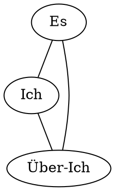

Die Marquise von O erleidet im gleichnamigem Buch eine Identitätskrise nachdem die Marquise von O erfährt, dass der Graf sie vergewaltigt hatte und nun um Ihre Hand bittet.

Eine psychoanalytische Diskussion dieser Identitätskrise aufgrund einer Aufteilung in Triebe (Es), bewusster Persönlichkeit (Ich) und Gewissen (Über-Ich) findet statt.

Das Gewissen (Über-Ich) der Marquise ist sicherlich auf den Ruf der Marquise und der Familie belangt.
Das Über-Ich der Marquise würde sicherlich darauf bestehen, dass die Marquise ihren Vergewaltiger, den Grafen F heiratet.

Die Triebe (Es) der Marquise wollen bestimmt nicht, dass die Marquise ihren Vergewaltiger heiratet.
Das Es der Marquise will, dass die Marquise ihrem Trieb nach Freiheit oder auch Unabhängigkeit der Familie oder des Grafen F nachgeht.

Die Rolle der bewussten Persönlichkeit (Ich) ist die des Mediators, der für die Marquise entscheidet, was sie tut.
Das Ich der Marquise steht aber inmitten des Konflikts zwischen Es und Über-Ich, welche wollen, dass die Marquise den Grafen sowohl heiratet und nicht heiratet.

Dazu kommt noch, dass die Marquise den Grafen von F als Retter angesehen hat und ihr bewusstes Ich mit diesem Konflikt zwischen vorheriger Wahrnehmung und jetziger Wahrnehmung überfordert wird.

Diese vielen Faktoren resultieren in einer Identitätskrise die durch den Konflikt zwischen den drei wesentlichen Persönlichkeitsinstanzen charakterisiert wird.

---

Mein eigener Vater hat mich rausgeschmissen.
Ich fass es nicht.
Ein Vater schließt doch nicht sein Kind aus dem Eigenheim raus!
Ich glaub es nicht.
Er hat mich nicht rausgeschmissen.
Er ist bestimmt nur wütend auf mich.
Ich bin mir sicher, wenn er sich beruhigt dann nimmt er mich wieder auf.

Dieser Vater!
Ein Verräter ist er.
Sein eigenes Kind im Stich lassen, nur weil diese Hebamme.
Diese Hebamme.
Oh Gott oh Gott die Hebamme sagte ich seie...
Das Monster schmeißt mich doch wirklich raus.

Was kann ich tun? Was kann ich tun?
Wenn ich mich bei im Entschuldige..
Aber nein, er hat ja eine Waffe gezogen.
Wie soll ich mich von meinem Leid erlösen?
Soll ich ihm Entschädigung geben?
Soll ich ihm...

Aber nein, er wird mich nicht annehmen.
Wenn ich doch nur nicht, aber nein, ich habe ja nichts...
Oder?
Das ist am schlimmsten, ledig und mit Kind.
Wer wird mich noch nehmen wollen?
Was werden die Menschen denken?
Werden sie glauben ich sei leicht zu bekommen?
Glauben sie ich bin ein lustiges Mädel?

Aber ich muss da durch.
Ich werde mich zum Landsitz bewegen.
Ich werde mich da um meine Kinder kümmern.
Ich werde sie wohlerziehen und dafür Sorgen, dass sie gut voranwachsen.
Ja. Das werde ich tun.
Dann habe ich meine Pflicht getan.
Mehr kann ich auch nicht tun.

Ich hoffe nur meine Anzeige wird beantwortet.

---

# Die Identitätskrise der Marquise

Über-Ich:
- Anweisungen des Vaters als Familienüberhaupt
- Gesellschaftliche Werte

Es:
- leben in Askese
- Liebe und Zuneigung der Familie

Ich:
- Verdrängung der Identität des Vaters
- schuldfreies Bewusstsein erlebt Unrecht durch die Verbannung

Lösung: Befreiung vom Elternhaus, Ergreifen der Initiative