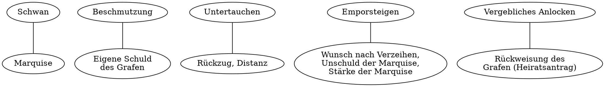

7.9. Der Traum des Grafaen

Klausur: Sachtextanalyse zu Marquise von O. (Sekundärliteratur)

---

Cohn vermeidet von einer Vergewaltigung zu sprechen.
Nach ihr soll von der Marquise der Tatbestand aus Scham nicht eingestanden oder auch vergessen sein.
Das Verfallen in die Ohnmacht wird als verspätete übertriebene Reaktion oder auch Flucht von der Situation mit Hinblick auf den Übergriff der Russischen Soldaten interpretiert.

Politzer behauptet, dass die Marquise sich an den Vorfall erinnern haben müsste.
Unter Verweis auf den "allgemeinen Menschenverstand" soll das Gegenteil "nicht recht vorstellbar" sein.

Die Aussagen, die auf den Vorstellungen der frühen Neuzeit beruhen weisen der Frau im Falle der Schwangerschaft die aktive sexuelle Rolle zu.
Diese Ansicht wird in der Reaktion des Umfelds der Marquise im Buch reflektiert.

Politzer und Cohn bewerten die Reaktion der Marquise als gewaltsame Überreaktion gegen die Präsenz eines geliebten oder auch als "hysterisch" mit Verweis auf Freud.

Cohn verwendet als Argument den Bewusstseinszustand der Marquise, die im Text "bewusstlos niedersank".
Cohn weist darauf hin, dass nicht der Begriff der Ohnmacht verwendet wird, obwohl darauf hingewiesen werden muss, dass der Zustand von Kleist mit "aus ihrer Ohnmacht wieder erholt" aufgelöst wird.

Im Text wird vom Kommandanten, der Mutter und der Hebamme überhaupt nicht auf eine Ohnmacht eingegangen.
Sie spiegeln der Tendenz des 18. Jahrhunderts wieder solche Zustände mit Skepsis zu betrachten.

---

HA: Beurteile die Frage "Vergewaltigung oder erotisches Erlebnis". Beziehe dich dabei argumentativ auf die Novellenhandlung, Freuds Kategorien der Psychoanalyse und die Überlegungen von Cohn und Politzer.
