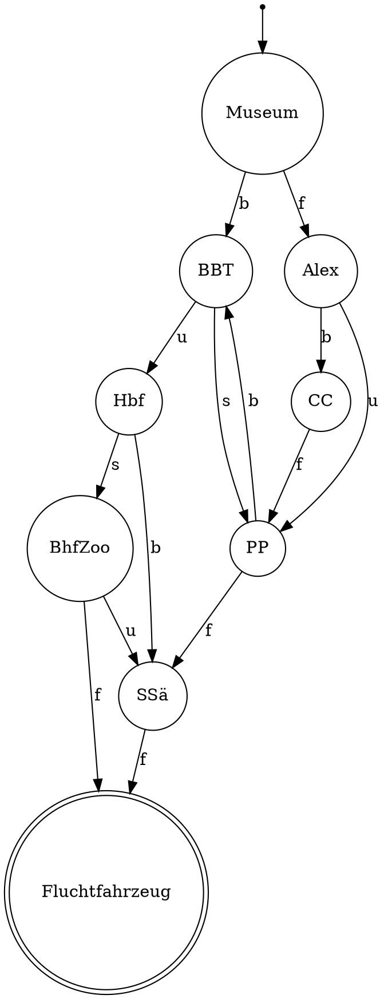

```
Nichtterminale: S, B, C, RS, SS, TB, HC, H
Terminale: h, t, s, r
Startsymbol: S
Produktionsregeln:
S -> rS | sS | hB | tRS | tSS | tTB | tHC | tH
B -> rS | hC | sTB | sHC | sRS | sSS | sH | h | t
C -> hC | tC | sB | rTB | rRS | rHC | rH | h | t
RS -> rS
SS -> sS
TB -> tB
HC -> hC
H -> h
```


---

fbfff

fuff

bubf

---

```
Nichtterminale: 
Terminale: f, b, u, s
Startsymbol: Museum
Produktionsregeln:
Museum -> f Alexanderplatz | b Brandenburger
Brandenburger -> u Hbf | s Potsdamer
Potsdamer -> f Siegessäule | b Brandenburger
Checkpoint -> f Potsdamer
Alexanderplatz -> b Checkpoint | u Potsdamer
Hbf -> b Siegessäule | s Bahnhof
Siegessäule -> f Fluchtfahrzeug
Bahnhof -> f Fluchtfahrzeug | u Siegessäule
Fluchtfahrzeug -> empty
```




Formaler automat:

$$A=(\Sigma, Q, \delta, q_0, F)$$

$$\Sigma=\{f,b,u,s\}$$

$$Q=\{Museum,BBT,PP,CC,Alex,Hbf,SSä,BhfZoo\}$$

$$q_0=Museum$$

$$F=\{Fluchtwagen\}$$