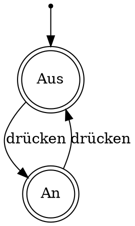
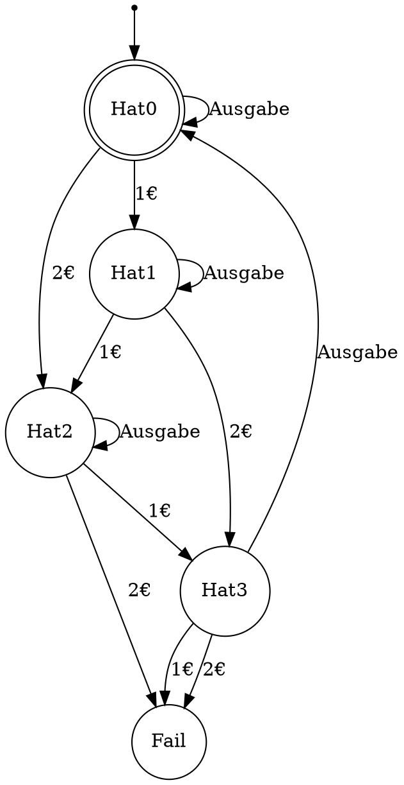
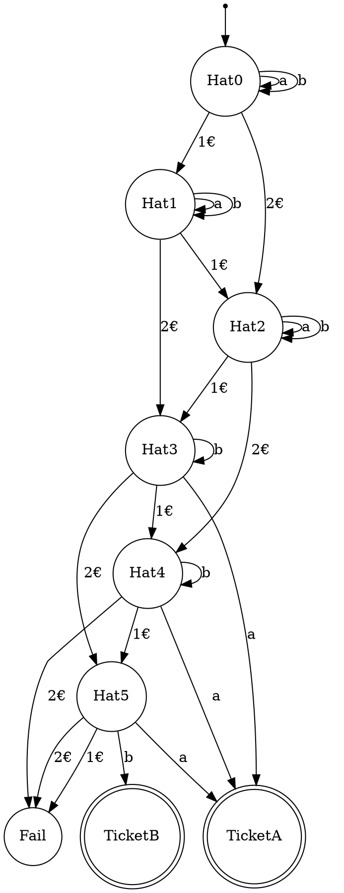

Endlicher Automat: Lichtschalter

```dot
digraph {

node [shape=point] Start;
Start;

node [shape=doublecircle] 
Start -> Aus
An -> Aus [label="drücken"];
Aus -> An [label="drücken"];
}
```

---

```dot
digraph {

node [shape=point];
Start;

node [shape=doublecircle];
Hat0;

node [shape=circle];

Start -> Hat0;

Hat0 -> Hat1 [label="1€"];
Hat0 -> Hat2 [label="2€"];

Hat0 -> Hat0 [label="Ausgabe"];
Hat1 -> Hat1 [label="Ausgabe"];
Hat2 -> Hat2 [label="Ausgabe"];

Hat1 -> Hat2 [label="1€"];
Hat1 -> Hat3 [label="2€"];

Hat2 -> Hat3 [label="1€"];
Hat2 -> Fail [label="2€"];

Hat3 -> Hat0 [label="Ausgabe"];
Hat3 -> Fail [label="1€"];
Hat3 -> Fail [label="2€"];
}
```

---

```dot
digraph {

node [shape=point];
Start;

node [shape=doublecircle];
TicketA;
TicketB;

node [shape=circle];

Start -> Hat0;

Hat0 -> Hat1 [label="1€"];
Hat0 -> Hat2 [label="2€"];
Hat0 -> Hat0 [label="a"];
Hat0 -> Hat0 [label="b"];

Hat1 -> Hat2 [label="1€"];
Hat1 -> Hat3 [label="2€"];
Hat1 -> Hat1 [label="a"];
Hat1 -> Hat1 [label="b"];

Hat2 -> Hat3 [label="1€"];
Hat2 -> Hat4 [label="2€"];
Hat2 -> Hat2 [label="a"];
Hat2 -> Hat2 [label="b"];

Hat3 -> Hat4 [label="1€"];
Hat3 -> Hat5 [label="2€"];
Hat3 -> TicketA [label="a"];
Hat3 -> Hat3 [label="b"];

Hat4 -> Hat5 [label="1€"];
Hat4 -> Fail [label="2€"];
Hat4 -> TicketA [label="a"];
Hat4 -> Hat4 [label="b"];

Hat5 -> Fail [label="1€"];
Hat5 -> Fail [label="2€"];
Hat5 -> TicketA [label="a"];
Hat5 -> TicketB [label="b"];


}
```