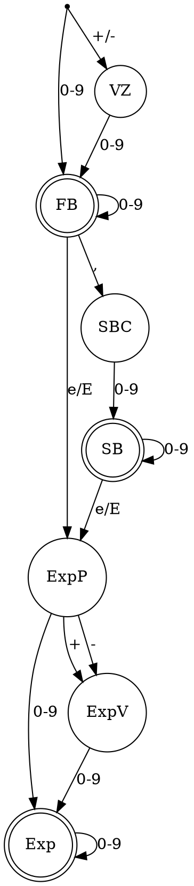

```dot
digraph {
node [shape=point];
Start;

node [shape=doublecircle];
FB;
SB;
Exp

node [shape=circle];

Start -> VZ [label="+/-"]
Start -> FB [label="0-9"]

VZ -> FB [label="0-9"];

FB -> FB [label="0-9"];
FB -> ExpP [label="e/E"];

FB -> SBC [label=","];

SBC -> SB [label="0-9"]

SB -> SB [label="0-9"];

SB -> ExpP [label="e/E"];

ExpP -> ExpV [label="+"];
ExpP -> ExpV [label="-"];
ExpP -> Exp [label="0-9"];

ExpV -> Exp [label="0-9"]

Exp -> Exp [label="0-9"];


}
```