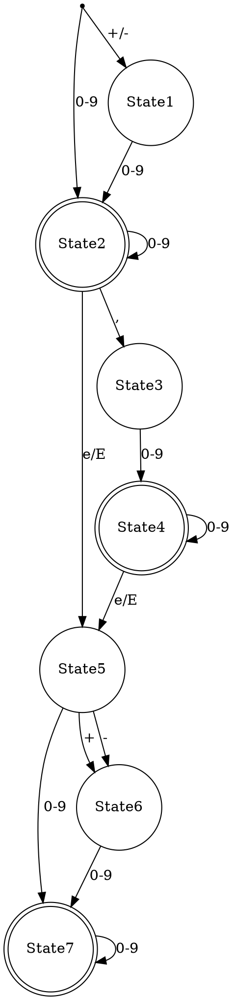

```
deffun uebergangsfunktion(inp :: Char) :: Unit = {
    charCat :: Int = categorizeInp(inp)
    state = uebergangstabelle[charCat, state];
}
defint n :: Int = {-1}
deftable uebergangstabelle[4][8] = [
    [1, n, n, n, n, 6, n, n],
    [2, 2, 2, 4, 4, 7, 7, 7],
    [n, n, 3, n, n, n, n, n],
    [n, n, 5, n, 5, n, n, n],
]
}
deffun categorizeInp(inp:: Char) :: Int = {
    if(inp == "+" || inp == "-") {
        return 0;
    }
    if (0 <= inp && inp <= 9) {
        return 1;
    }
    if (inp == ",") {
        return 2;
    }
    if (inp == "E" || inp == "e") {
        return 3;
    }
}
```