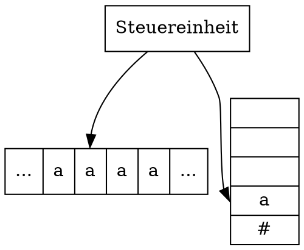

Aufgabe 3:

a)

Alle Produktionsregeln gehen von einem und nur einem Nonterminal aus.

Damit ist die Sprache kontextfrei.

b)

Die Produktionsregel `S->SS` leitet ein Nonterminal in zwei Duplikate ab.

Dies ist nicht in einer regulären Sprache replizierbar.

---

a)

b)

Wort1: "b"
Wort2: "aba"
Wort3: "aabaa"

c)

i) Nein

ii) Ja

iii) Nein

d)

Nur iii ist Wahr.

e)

