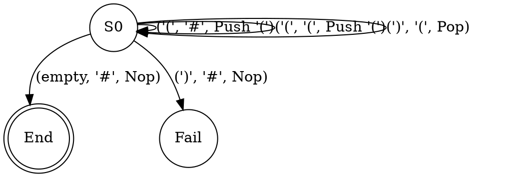
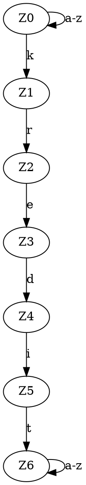

```dot
digraph {
node [shape="doublecircle"];
End;

node [shape="circle"];

S0 -> S0 [label="('(', '#', Push '(')"];
S0 -> S0 [label="('(', '(', Push '(')"]
S0 -> S0 [label="(')', '(', Pop)"]
S0 -> Fail [label="(')', '#', Nop)"]
S0 -> End [label="(empty, '#', Nop)"]
}
```

---

```dot
digraph {
Z0 -> Z0 [label="a-z"]
Z0 -> Z1 [label="k"]
Z1 -> Z2 [label="r"]
Z2 -> Z3 [label="e"]
Z3 -> Z4 [label="d"]
Z4 -> Z5 [label="i"]
Z5 -> Z6 [label="t"]
Z6 -> Z6 [label="a-z"]
}
```

