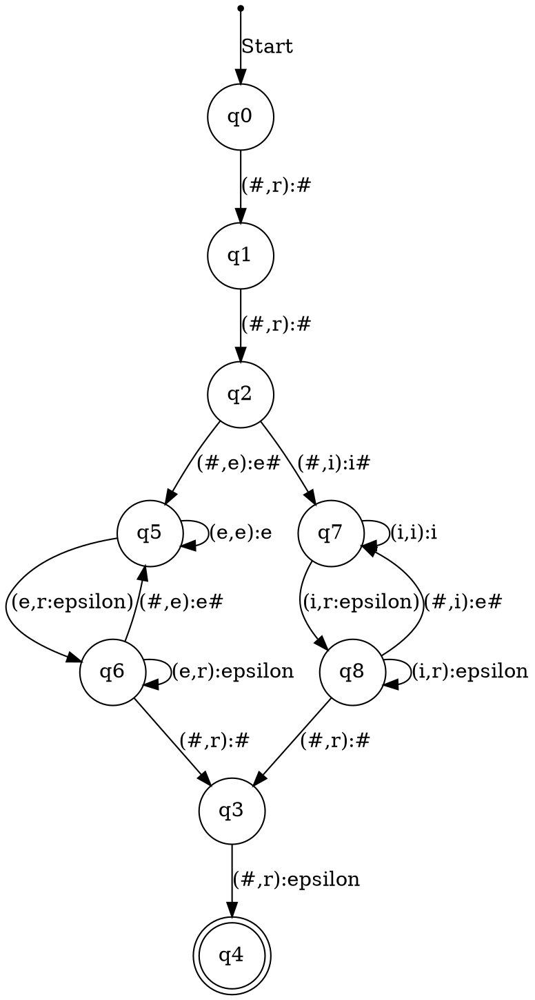
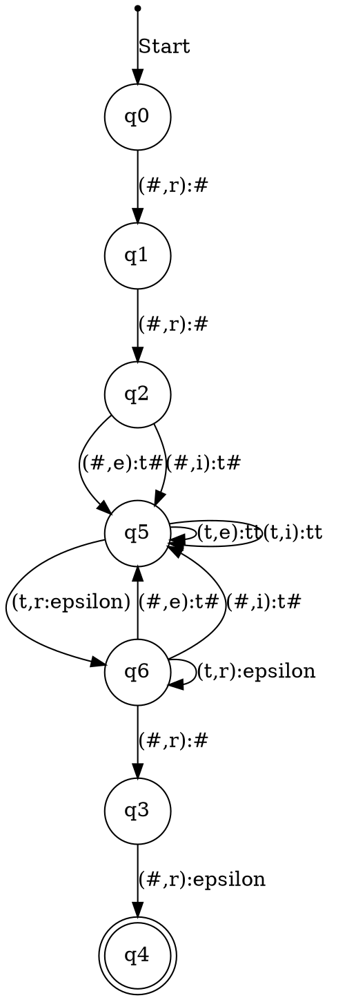

```dot
digraph {
Node [shape="point"];
Start;

Node [shape="circle"];

Start -> q0 [label="Start"];

q0 -> q1 [label="(#,r):#"];
q1 -> q2 [label="(#,r):#"];
q2 -> q5 [label="(#,e):e#"];
q2 -> q7 [label="(#,i):i#"];

q5 -> q5 [label="(e,e):e"];
q5 -> q6 [label="(e,r:epsilon)"];
q6 -> q5 [label="(#,e):e#"];
q6 -> q6 [label="(e,r):epsilon"];
q6 -> q3 [label="(#,r):#"]

q7 -> q7 [label="(i,i):i"];
q7 -> q8 [label="(i,r:epsilon)"];
q8 -> q7 [label="(#,i):e#"];
q8 -> q8 [label="(i,r):epsilon"];
q8 -> q3 [label="(#,r):#"]

Node [shape="doublecircle"];

q3 -> q4 [label="(#,r):epsilon"]
}
```

```dot
digraph {
Node [shape="point"];
Start;

Node [shape="circle"];

Start -> q0 [label="Start"];

q0 -> q1 [label="(#,r):#"];
q1 -> q2 [label="(#,r):#"];
q2 -> q5 [label="(#,e):t#"];
q2 -> q5 [label="(#,i):t#"];

q5 -> q5 [label="(t,e):tt"];
q6 -> q5 [label="(#,e):t#"];

q5 -> q5 [label="(t,i):tt"];
q5 -> q6 [label="(t,r:epsilon)"];
q6 -> q5 [label="(#,i):t#"];
q6 -> q6 [label="(t,r):epsilon"];
q6 -> q3 [label="(#,r):#"];

Node [shape="doublecircle"];

q3 -> q4 [label="(#,r):epsilon"]
}
```