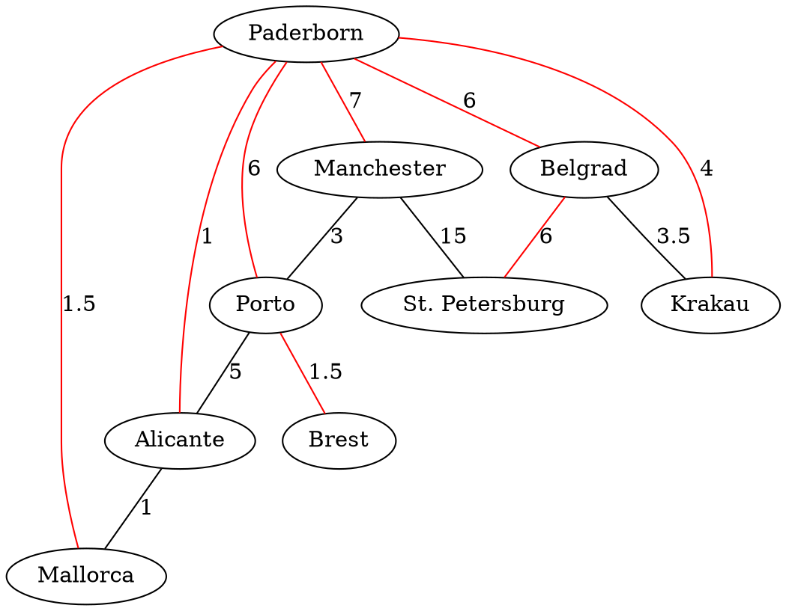

```dot
graph {
    Paderborn -- Manchester [label=7,color=red]
    Paderborn -- Porto [label=6,color=red]
    Paderborn -- Alicante [label=1,color=red]
    Paderborn -- Mallorca [label=1.5,color=red]
    Paderborn -- Belgrad [label=6,color=red]
    Paderborn -- Krakau [label=4,color=red]
    Manchester -- "St. Petersburg" [label=15]
    Manchester -- Porto [label=3]
    Porto -- Brest [label=1.5,color=red]
    Porto -- Alicante [label=5]
    Alicante -- Mallorca [label=1]
    Belgrad -- Krakau [label=3.5]
    Belgrad -- "St. Petersburg" [label=6,color=red]
}
```

Der neue Flugplan kostet 33 Euro.