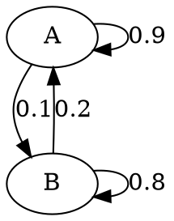

# Diffusion
## a)

Die Übergänge, die auf den gleichen Zustand zurückzeigen, stellen die Anteile die Teilchen dar, die in dem Behälterteil geblieben sind. Die Übergänge zum jeweils anderen Zustand stellen die Anteile der Teilchen dar, die den Behälter gewechselt haben.

## b)
|     | A      | B     |
| --- | ------ | ----- |
| A   | $0.75$ | $0.4$ |
| B   | $0.25$ | $0.6$ |

$25\%$ der Teilchen aus A sind in den Behälter B gewechselt. $40\%$ der Teilchen aus B sind in den Behälter A gewechselt.

# Schulmensa
## a)
$A=\begin{pmatrix}0.88&0.26\\0.12&0.74\end{pmatrix}$

- Montag
  - V:$100$
  - N:$200$
- Dienstag
  - $A\cdot\begin{pmatrix}100\\200\end{pmatrix}=\begin{pmatrix}88&52\\12&148\end{pmatrix}$
  - V:$140$
  - N:$160$
- Mittwoch
  - $A\cdot\begin{pmatrix}140\\160\end{pmatrix}=\begin{pmatrix}123.2&41.6\\16.8&118.4\end{pmatrix}$
  - V:$164.8\approx165$
  - N:$135.2\approx135$
- Donnerstag
  - $A\cdot\begin{pmatrix}165\\135\end{pmatrix}=\begin{pmatrix}145.2&35.1\\19.8&99.9\end{pmatrix}$
  - V:$180.3\approx180$
  - N:$119.7\approx120$
- Freitag
  - $A\cdot\begin{pmatrix}180\\120\end{pmatrix}=\begin{pmatrix}158.4&31.2\\21.6&88.8\end{pmatrix}$
  - V:$189.6\approx190$
  - N:$110.4\approx110$