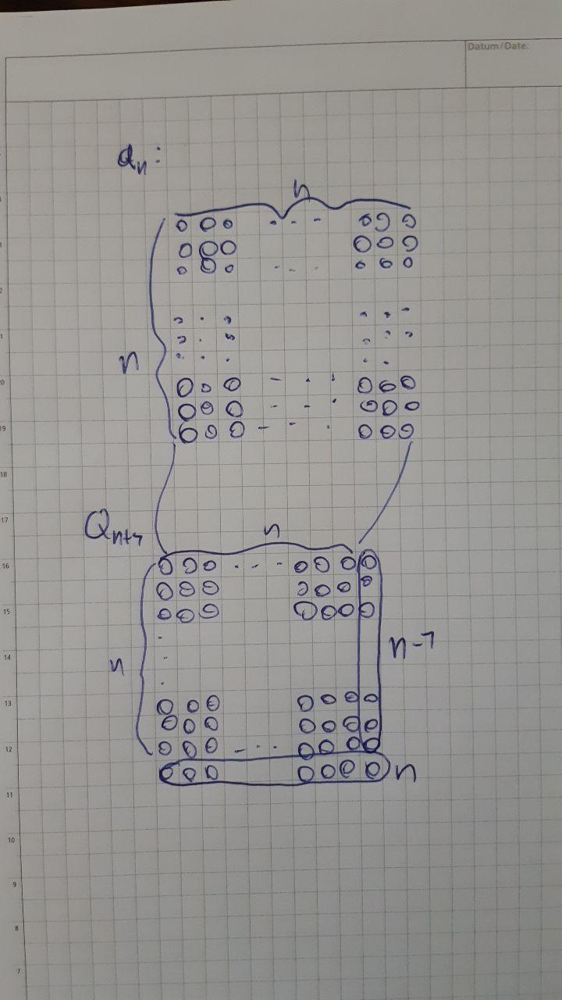

# Dreiecks- und Quadratzahlen

c)

(i)

$$Q_n=n^2$$

(ii)

$$Q_{n+1}=Q_n+n+(n-1)$$
oder
$$Q_{n+1}=Q_n+2n-1$$

(iii)

d)

(i)

### Jede Dreickszahl ist auch eine Quadratzahl

Proposition:

$$\forall n\in\mathbb{N}:\exists o\in\mathbb{N}:D_o=n\land\exists p\in\mathbb{N}:Q_p=n$$

Gegenbeispiel:

$$n=3$$

$$D_2=3$$

Aber es gibt keine Quadratzahl die $3$ ist.

Beweis:

$$Q_1=1$$

$$Q_2=4$$

$$Q_1<3<Q_2$$

Weil $Q_n$ monoton steigend ist, gibt es keine Quadratzahl, die 3 ist.

(ii)

### Es gibt Dreickszahlen, die auch Quadratzahlen sind

Proposition:

$$\exists n\in\mathbb{N}: \exists o\in\mathbb{N}:D_o=n\land\exists p\in\mathbb{N}:Q_p=n$$

Beweis:

Für $n=1$:

$$D_1=1=Q_1$$

$\Box$

(iii)

### $n$ und $D_n$ haben bei der Division durch 3 denselben Rest

Gegenbeispiel:

$n=2$

$$D_2=3$$

$$n\mod 3=2$$

$$D_2\mod 3=0$$

$$2\neq0$$

(iv)

### Die Dreieckszahlen sind nacheinander immer: gerade, ungerade, ungerade, gerade ...

Proposition:

$$\forall n\in\mathbb{N}^0:\text{gerade}\,d_{4n}\land\text{ungerade}\,d_{4n+1}\land\text{ungerade}\,d_{4n+2}\land\text{gerade}\,d_{4n+3}$$

Hilfsproposition:

$$\forall n\in\mathbb{N}^0:\text{gerade}\,d_n\iff\text{gerade}\,d_{n+4}$$

Beweis von $\forall n\in\mathbb{N}^0:\text{gerade}\,d_n\implies\text{gerade}\,d_{n+4}$:

Gegeben sei ein $n\in\mathbb{N}^0$.
Gegeben sei ein $p\in\mathbb{N}^0$ mit $2p=d_n$

$$\begin{aligned}
d_{n+4}&=d_{n+3}+n+3+1\\
&=d_{n+2}+n+2+1+n+3+1\\
&=d_{n+1}+n+1+1+n+2+1+n+3+1\\
&=d_n+n+1+n+1+1+n+2+1+n+3+1\\
&=d_n+4n+10\\
&=2p+4n+10\\
&=2(p+2n+5)\\
\end{aligned}$$

$\Box$

Beweis von $$\forall n\in\mathbb{N}^0:\text{gerade}\,d_n\impliedby\text{gerade}\,d_{n+4}$$
also (Kontraposition)
$$\forall n\in\mathbb{N}^0:\text{ungerade}\,d_n\implies\text{ungerade}\,d_{n+4}$$

Gegeben sei ein $n\in\mathbb{N}^0$.
Gegeben sei ein $p\in\mathbb{N}^0$ mit $2p+1=d_n$.

$$\begin{aligned}
d_{n+4}&=d_{n+3}+n+3+1\\
&=d_{n+2}+n+2+1+n+3+1\\
&=d_{n+1}+n+1+1+n+2+1+n+3+1\\
&=d_n+n+1+n+1+1+n+2+1+n+3+1\\
&=d_n+4n+10\\
&=2p+1+4n+10\\
&=2(p+2n+5)+1\\
\end{aligned}$$

$\Box$

Beweis von $$\forall n\in\mathbb{N}^0:\text{gerade}\,d_{4n}\land\text{ungerade}\,d_{4n+1}\land\text{ungerade}\,d_{4n+2}\land\text{gerade}\,d_{4n+3}$$
mit Induktion:

Basisfall: $$n=0$$

$$d_{0}=0\quad\text{(gerade)}$$

$$d_{1}=1\quad\text{(ungerade)}$$

$$d_{2}=3\quad\text{(ungerade)}$$

$$d_{3}=6\quad\text{(gerade)}$$

Induktionsfolgerung:

Gegeben sei ein $n\in\mathbb{N}^0$ mit $\text{gerade}\,d_{4n}\land\text{ungerade}\,d_{4n+1}\land\text{ungerade}\,d_{4n+2}\land\text{gerade}\,d_{4n+3}$.

Dann gilt:

$$\text{gerade}\,d_{4(n+1)}\land\text{ungerade}\,d_{4(n+1)+1}\land\text{ungerade}\,d_{4(n+1)+2}\land\text{gerade}\,d_{4(n+1)+3}$$

aus der Hilfsproposition.

$\Box$